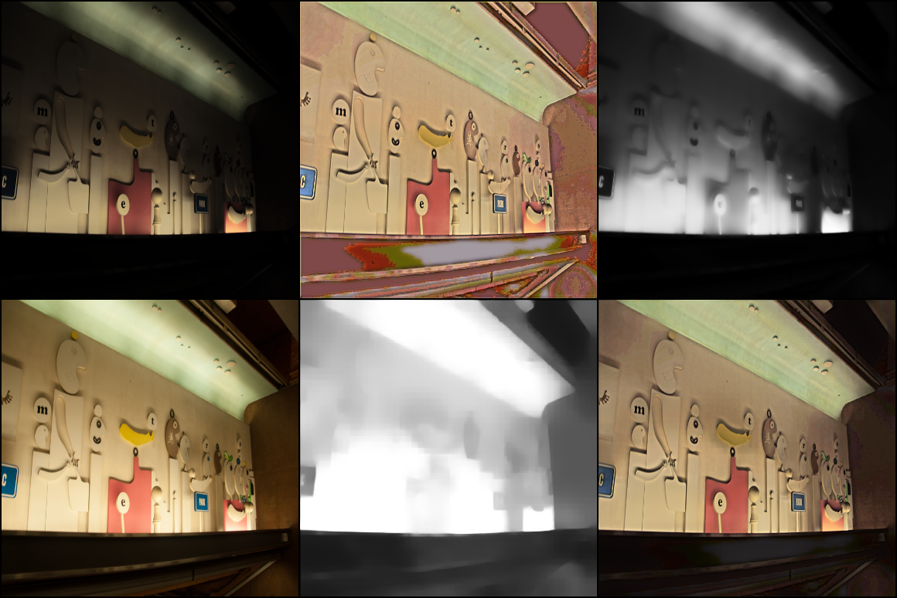

# RetinexNet-PyTorch (Modernized)

This repository provides a modernized PyTorch implementation of **Deep Retinex Decomposition for Low-Light Enhancement** (BMVC 2018). 

While the original paper was implemented in TensorFlow and previous PyTorch ports (such as [houze-liu's](https://github.com/houze-liu/RetinexNet_pytorch)) were built on older versions, this repository features a rewritten codebase to support **modern PyTorch environments**, improve **training efficiency**, and provide enhanced **visualization**.

## 📖 Theoretical Background
The Retinex theory assumes that an image $S$ can be decomposed into two components: Reflectance $R$ and Illumination $I$:

$$S = R \circ I$$

Where $\circ$ denotes element-wise multiplication. This model aims to decompose the low-light image and enhance it by adjusting the illumination component.

## 📂 Dataset Setup

The model is trained using the **Synthetic Image Pairs** dataset.
1. Download the dataset from RetinexNet_ori: [Synthetic Image Pairs from Raw Images](https://drive.google.com/file/d/1G6fi9Kiu7CDnW2Sh7UQ5ikvScRv8Q14F/view?usp=drive_open).
2. Organize the data directory as follows:

```text
- path/to/BrighteningTrain/
  - low/   # Low-light input images
  - high/  # Ground truth/Normal-light images
```

## 🛠️ Usage

1. Training. Update the ```dataroot``` path in ```datapipeline.py``` within the ```Get_paired_dataset``` function, then run:

  ```python
  python train.py
  ```

2. Testing. To generate enhanced results from your test set:

  ```python
  python test.py
  ```

3. Evaluation. To measure the performance (PSNR and SSIM) of the generated results:

```python
python evaluation.py
```

## 📊 Results
The following image demonstrates the decomposition and enhancement process (results from Epoch 180):

**Image Layout Reference:**

| Row | Column 1 | Column 2 | Column 3 |
| :--- | :--- | :--- | :--- |
| **Top** | Input Low-light ($S$) | Decomposed Reflectance ($R$) | Decomposed Illumination ($I$) |
| **Bottom** | Ground Truth | Reconstructed $\hat{I}$ | Final Result $\hat{S}$ |




## 📜 Acknowledgments

1. Original Paper: Wei, C., Wang, W., Yang, W., & Liu, J. (2018). Deep Retinex Decomposition for Low-Light Enhancement. [Project Page](https://daooshee.github.io/BMVC2018website/).

2. Reference Implementation: Based on the work by [houze-liu/RetinexNet_pytorch](https://github.com/houze-liu/RetinexNet_pytorch).